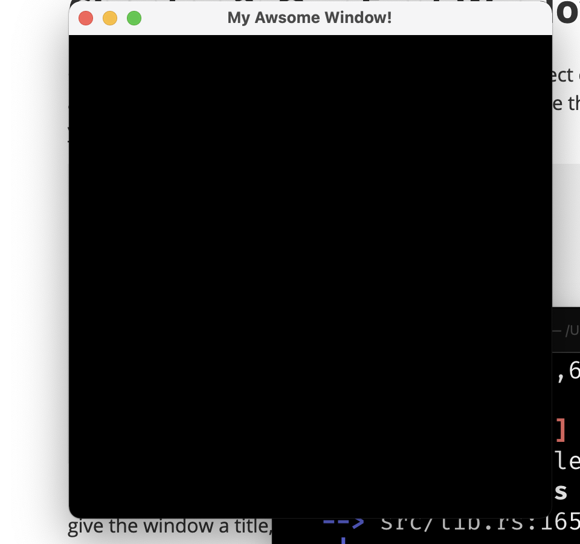

# Chapter 2: Our First Window

Creating a window is easy! First n your main.rs file select every thing and delete it. Now that we have a clean workspace we can add some window code. Use the  following to create a window. I will tell you what everything does in just a moment
```rust
use maple::*;
fn after_load(place_holder: String) -> String{
	return place_holder;
}
fn main(){
	let win = Window {
		title: String::from("My Awsome Window!"),
		height: 400,
		width: 400,
		name: String::from("Maple Test")
	};
	win.start_window(after_load);
}
```
Now lets find out what this does. In the main function we declare a "Window" object name "win". We give the window a title, a height, a width, and a name.
Then we create the window with "win.start_window" then we pass in the "after_load" function which will run after the window is create on another thread. To run our program open your terminal and type
```
cargo run
```
Now a window should popup that looks like this:

